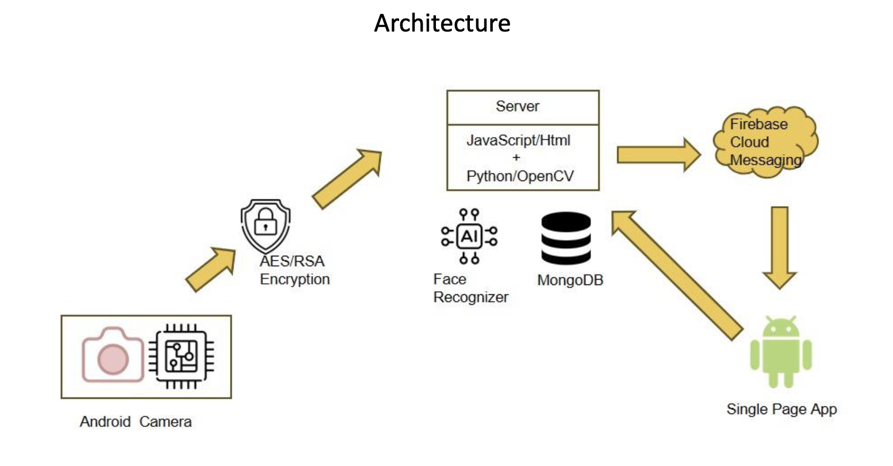
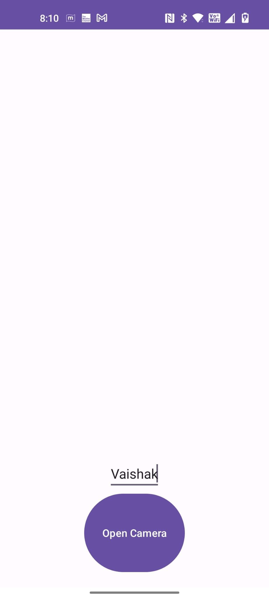
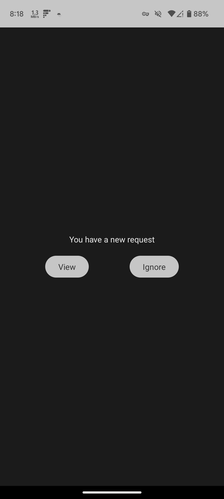
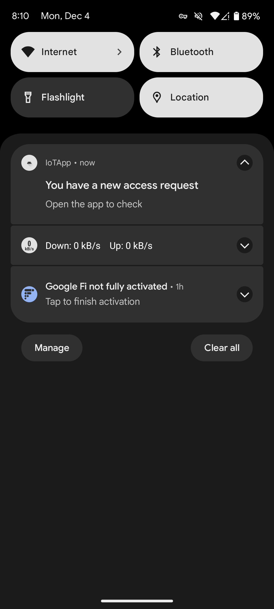
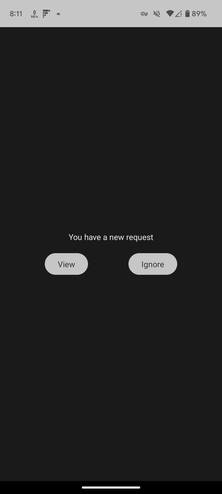
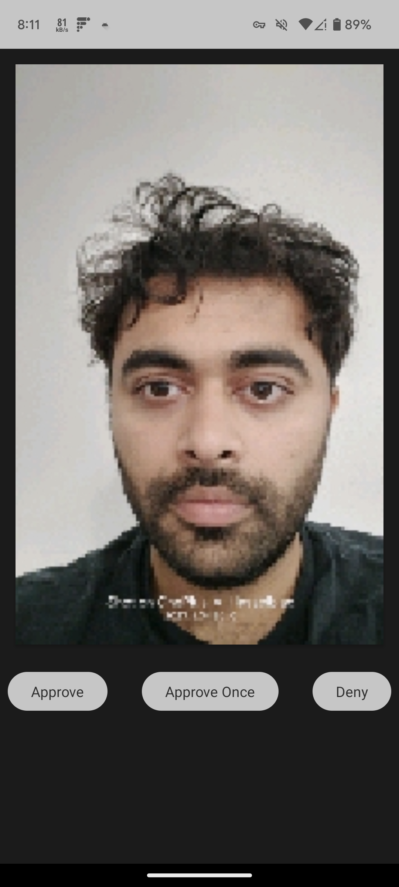

**Guide to the solution**

 "Solution high level architecture"

**IoTApp**

This is an android application that the admin needs to install on their phone. The IoT app registers itsef to the FCM service which enables it to receive notifications from the server. For the purpose of the project , the FCM key is currently hardcoded in the server.

 The role of the app is to approve/ deny new face requests.

Below are a few acreenshots which are self explainatory.

 
"Entry Point"

 
!(Results/pending.jpeg "Face was not recognized. Pending approval")

 
!(Results/success.jpeg "Face was successfully recognized")

**Client App**

This is also an android application that the client/user needs to install on their phone. The client needs to open the app and take a picture of their face . The app then sends this to the server which checks if teh face is registered in the system . We get a SUCCESS or CHECK BACK LATER message.

Below are a few acreenshots which are self explainatory.

 
 "Entry Point"

 
"New access request alert"

 
"Entry Point with queued request"

 
"Main screen"

**Server**

This is a NodeJS supported backend server. It is the brains of our system. It also includes python files trainer.py and test.py which are the interfaces for our facial recognition system. It leverages OpenCV internally. The server also has FCM master keys to send notiications. 
Server.js provides endpoints that are accesssed by admin and client apps for our system.